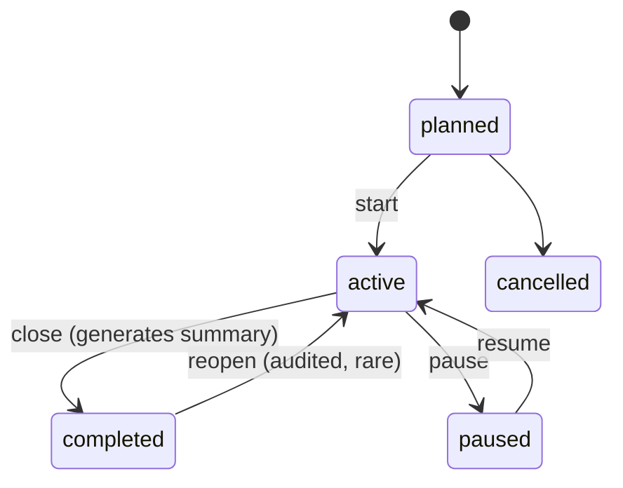
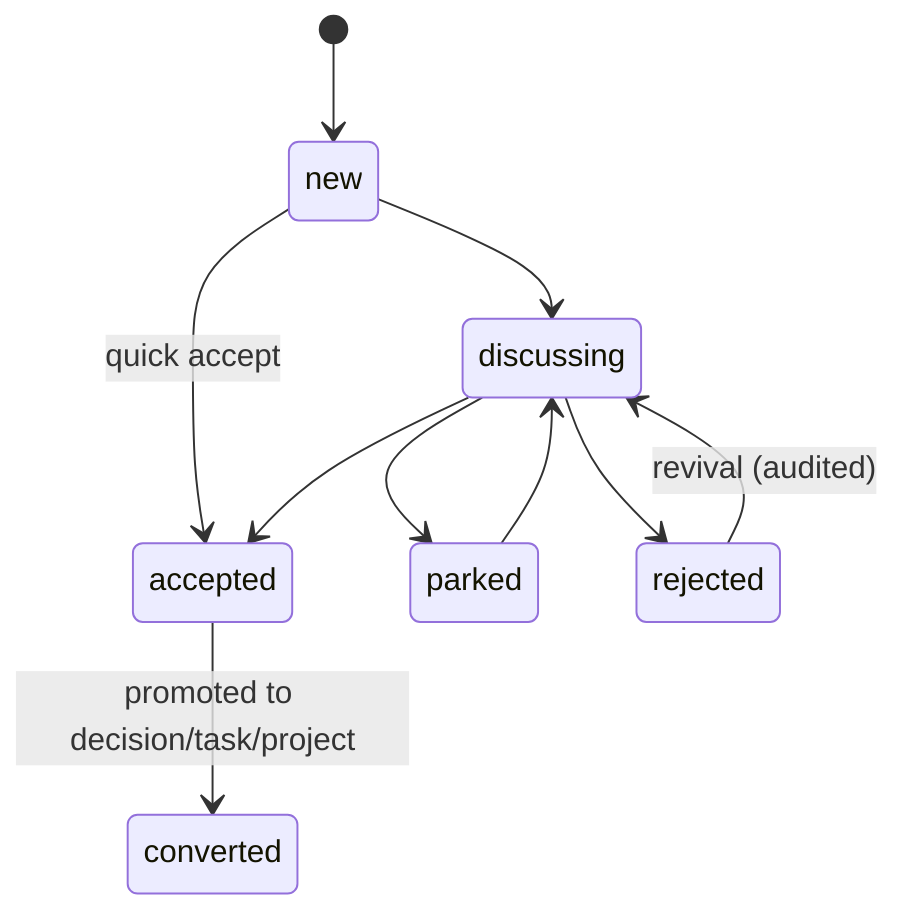
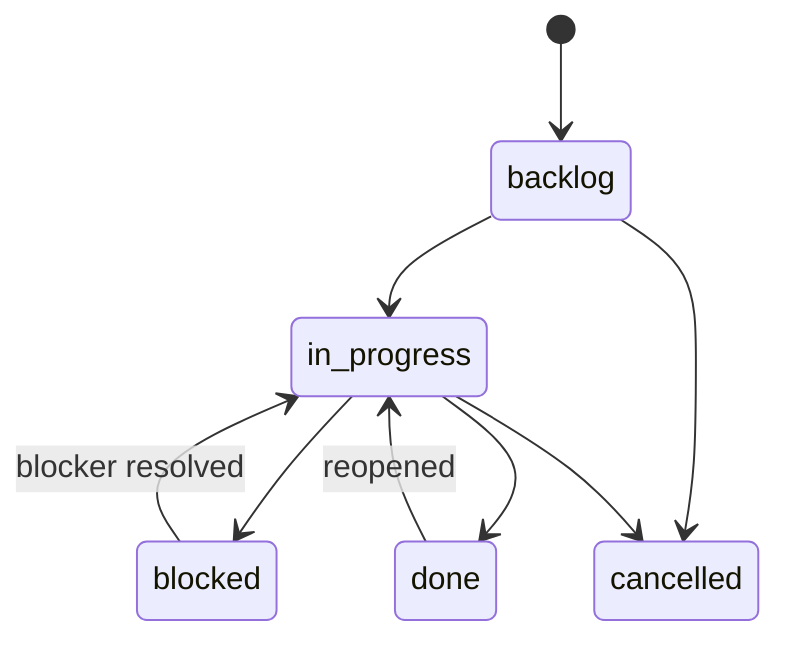

# 03 - Domain Model

## Shape of the model

Three layers, deliberately separate:

1. **Tenancy and people** - Organisation -> Team -> Membership -> User. Never
   hard-code "KBC" or "Innovations" anywhere else in the schema.
2. **The loop** - Session -> (Game play, Idea, Decision, Task, Blocker). This is
   where the meeting lives.
3. **The record** - Activity, Comment, XP event, Achievement. Append-only,
   polymorphic, attached to everything above.

```text
                    Organization
                         |
                       Team
                    /    |     \
              Membership  |   Invite
                 |        |
               User     Project
                          |
                          v
   Session ----> Idea ---> Decision ----> Task <---- (owner, collaborators)
      |            \          |            |
      |             \         |            v
      |              \        |         Blocker
      v               v       v            v
   GamePlay        Comment  Comment      Comment
      |                                   |
      v                                   |
  ScoreEntry                              |
      |                                   |
      +---------------> Activity <--------+
                          ^
                          |
                    XP event -> Achievement -> Leaderboard
```

Key asymmetry to notice: **a Session is a container that closes; a Project is a
container that keeps going.** Tasks can be born in a session and live in a
project. That link (`task.origin_session_id`) is the spine of the whole product.

## Entities

### Tenancy and people

| Entity | Purpose | Key fields | Notes |
|---|---|---|---|
| `organization` | Tenant root, for future multi-org use | name, slug, settings jsonb | MVP 1 auto-creates one on first setup; nothing in the UI requires a second |
| `team` | The group that meets, e.g. Innovations | org_id, name, slug, description, settings | Everything user-facing scopes to a team |
| `user` | A person | email, display_name, avatar_url, password_hash or provider, locale, timezone, leaderboard_opt_out | One user may belong to several teams later |
| `membership` | User's relationship to a team | user_id, team_id, role, status, joined_at | Unique on (user_id, team_id) |
| `invite` | Pending access | team_id, email or code, role, invited_by, expires_at, accepted_at | Supports both email invites and a shareable code |
| `guest_participant` | Someone in a session without an account | session_id, display_name, email nullable, linked_user_id nullable | Can be claimed later by a real user; see [09](09-risks-and-open-questions.md) open question 5 |

### The loop

| Entity | Purpose | Key fields | Notes |
|---|---|---|---|
| `session` | A meeting | team_id, title, scheduled_at, started_at, ended_at, facilitator_id, status, location, summary_snapshot jsonb, sequence_no | `sequence_no` gives "Session #12" per team for free |
| `session_participant` | Who was in the session | session_id, user_id or guest_id, role (facilitator/participant/observer), attended, joined_at, left_at | Distinct from team membership: a guest can attend without joining the team |
| `agenda_item` | Ordered agenda | session_id, position, title, notes, timebox_minutes, covered_at | Not a task, not a decision. Just the order of the meeting |
| `game_definition` | A playable game type in the catalogue | key, name, family, config_schema jsonb, min_players, max_players, typical_minutes, energy, tags, source_type, license | Seeded data, admin-editable later; never hard-code game logic to a name |
| `content_pack` | A themed set of game content | game_definition_key, title, description, language, license, attribution, items | Copyright matters: license and attribution are required fields, see [06](06-games.md) |
| `game_question` | One unit of content | content_pack_id, position, prompt, answer, choices jsonb, media_url, difficulty, category, explanation | Used by question-based games; decks store prompts the same way so one content path serves both |
| `game_play` | An instance of a game in a session | session_id, game_definition_key, content_pack_id, host_id, mode, started_at, ended_at, settings jsonb, status | One session can contain many plays |
| `game_score` | A result for a player in a play | game_play_id, participant_id (user or guest), points, correct_count, position, source (`auto` / `host`), adjusted_by, adjustment_reason | Every manual adjustment is audited |
| `idea` | A proposal | team_id, session_id, title, description, created_by, status, converted_to_type, converted_to_id | `converted_to_*` preserves the promotion path |
| `idea_tag` | Free-form tags | idea_id, tag | Simple join table; no tag taxonomy in MVP 1 |
| `decision` | A recorded agreement | team_id, session_id, statement, rationale, decided_by, decided_at, supersedes_id, superseded_by_id | First-class even with no originating idea |
| `project` | A container for ongoing work | team_id, name, description, status, owner_id | Flat: no parent project in MVP 1 |
| `task` | The actionable unit | team_id, project_id, session_id (origin), idea_id, decision_id, title, description, owner_id, status, priority, due_date, completed_at, cancelled_reason | Session link is *origin*, not containment |
| `task_collaborator` | Extra people on a task | task_id, user_id | Keep separate from owner: exactly one owner |
| `blocker` | Something stopping work | task_id (or idea_id), raised_by, reason, raised_at, resolved_by, resolved_at, resolution | State on the task plus a real entity, so "Firefighter" XP has something to point at |
| `comment` | Discussion thread | target_type, target_id, author_id, body, created_at, edited_at, deleted_at | One flat thread per target. Targets in MVP 1: idea, decision, task, blocker, session |

### The record

| Entity | Purpose | Key fields | Notes |
|---|---|---|---|
| `activity` | The audit trail | team_id, session_id, actor_type, actor_id, verb, target_type, target_id, payload jsonb, occurred_at, source | Append-only. Never updated, never deleted. See [08](08-audit-trail.md) |
| `xp_event` | Points awarded | team_id, user_id or guest_id, amount, reason_key, source_type, source_id, awarded_by, awarded_at, season_id, idempotency_key | Append-only ledger. Leaderboard is derived, never a stored counter |
| `xp_rule` | Tunable rule table | key, label, amount, cap_per_session, cap_per_day, cap_per_week, active | So scoring can be rebalanced without a deploy |
| `season` | A leaderboard window | team_id, name, starts_at, ends_at, status | e.g. "Kika Season 1", 3 months |
| `achievement` | Achievement definition | key, name, description, emoji, criteria jsonb, rarity, active | Definitions are data, evaluation is a job |
| `achievement_award` | Awarded achievement | achievement_id, user_id or guest_id, season_id, awarded_at, source_type, source_id, awarded_by | Auditable, and reversible with an audit entry |
| `notification` | Reserved, mostly unused in MVP 1 | user_id, type, payload, sent_at, read_at | Only used by the daily digest; table exists so nothing is retrofitted |

## Relationships worth stating explicitly

| From | To | Cardinality | Rule |
|---|---|---|---|
| Session | Idea | 1:N | An idea may exist with no session (captured outside a meeting) but usually has one |
| Session | Decision | 1:N | A decision may exist with no session, with a required reason field in that case |
| Session | Task | 1:N (origin) | Tasks outlive sessions. Tasks may exist with no session at all |
| Idea | Decision | 1:N | One idea can produce several decisions; a decision needs no idea |
| Idea | Task | 1:N | An idea may be converted directly to a task without a decision |
| Decision | Task | 1:N | The common path: decide, then assign work |
| Task | Project | N:1 | Optional. A task may live only in a session |
| Task | Blocker | 1:N | A task can be blocked, unblocked, blocked again; each is a record |
| Anything | Comment | 1:N | Polymorphic, flat |
| Anything | Activity | 1:N | Polymorphic, append-only, automatic |

## State machines

### Session



Rules: only one `active` session per team at a time. Closing generates a summary
snapshot and freezes it; reopening is allowed but audited and marks the summary
stale. `completed` is not the same as `closed forever` - real meetings get
continued the next day.

### Idea



`converted` is set when a promotion link is created. The idea stays readable and
points at what it became.

### Task



Rules:

- A task may be unowned only in `backlog`. Any transition into `in_progress`,
  `blocked` or `done` requires an owner. This is enforced server-side.
- Entering `blocked` creates a `blocker` record. Leaving `blocked` requires
  resolving one.
- `done` sets `completed_at`; reopening clears it. Both are audited.

### Decision

No workflow. A decision is either current or superseded. Adding approval states
would turn a two-word act into an approval process nobody asked for.

### Game play

```text
pending -> running -> finished      (scoring auto or by host)
                  \-> abandoned
```

Abandoned plays are kept (they are part of what happened) but never scored.

## Invariants

These are the rules that must hold in code and, where possible, in the database.
They are the things a reviewer should check in every pull request.

1. **Every mutation writes an activity record.** No exceptions for "small" edits.
   See [08](08-audit-trail.md) for the taxonomy.
2. **Activity is append-only.** No code path updates or deletes an `activity` row.
   Database grants enforce it.
3. **Everything is team-scoped.** Every domain row carries `team_id` (directly or
   via its parent) and every query filters by it.
4. **Exactly one owner per task.** Collaborators are separate rows, never a second
   owner column.
5. **Blocked tasks have an open blocker.** Status and blocker records cannot
   disagree.
6. **A closed session has a frozen summary.** Regeneration is explicit and
   audited, and marks the previous snapshot superseded.
7. **XP is derived, never stored as a mutable total.** A user's score is
   `sum(xp_event.amount)`; any cached total is recomputable.
8. **An XP event is idempotent.** `(reason_key, source_type, source_id, user_id)`
   is unique, so replaying a job cannot double-award.
9. **Deletion is soft and audited.** Deleting sets `deleted_at` and writes an
   activity record containing a snapshot of what was removed.
10. **Guests are people too.** Guests can be participants, players, and task
    collaborators; they simply cannot log in until they claim a profile.

## Naming conventions

- Tables: plural snake_case (`session_participants`). Pick one style and never
  mix.
- Statuses: lowercase snake_case values, stored as text with a check constraint
  (or a Postgres enum - pick one; text plus a check is easier to evolve).
- The brief uses "Task / Action". **Use `task` everywhere in code and UI.** "Action"
  as a synonym is the kind of naming drift that costs a week later.
- "Session" collides with auth sessions. Use `session` for meetings and
  `auth_session` for login sessions, and never abbreviate either.
- Timestamps: UTC in the database, rendered in Africa/Nairobi (EAT) in the UI.
  Sessions store the team's timezone alongside the timestamp.
- IDs: UUIDv7 or ULID - sortable, non-enumerable, generated in the app.

## Resolved design questions in this model

| Question | Resolution |
|---|---|
| Is `Group` a real level between Project and Task? | No in MVP 1. Labels instead. See [09](09-risks-and-open-questions.md) challenge 2 |
| Are blockers a task status or an entity? | Both: status plus entity. XP and summary need the entity |
| Are decisions workflow items? | No. Recorded agreements, supersedable |
| Do ideas need votes? | Not in MVP 1 |
| Are game questions a separate domain from a deck? | No - one `content_pack` + `game_question` path serves both |
| Where does the "meeting" end and "work" begin? | At the session boundary; the task keeps `origin_session_id` forever |
